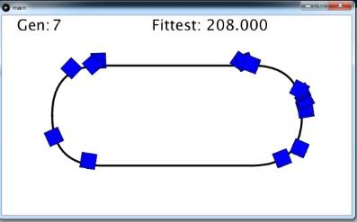
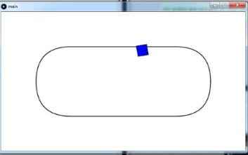
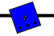
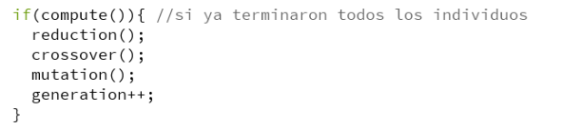
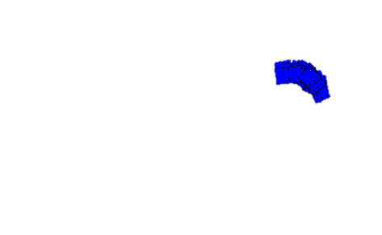

Kinematic control of a mobile Robot with the help of Artificial
Intelligence

Artificial Intelligence – Facultad de Ingeniería, UASLP

*Adviser: Dr. José Ignacio Núñez Varela*

Problem statement

A Robot kinematic has a microprocessor, such as two or more motor
actuators, and different sensors that help control the kinematics of
this, however, the response of a system is not instantaneous, there is a
margin of error in the response of the actuators and there are
environmental factors that are variable and cannot be controlled /
measured. Therefore, there are many techniques to control systems
according to the behavior of sensors and actuators.

Objective

To implement an optimization searching algorithm (e.g. Genetic
Algorithms), based on artificial techniques, which finds the best
configuration for getting high speed on a Line Follower.

By COVID situation it was impossible to me to implements a software on a
real robot, so I change the approach to a simulation of a line follower.

Work done
=========

I developed a simulator of a Line Follower which finds its best
configuration to follow a line in the lower time possible with Genetic
Algorithms. I use Processing for the implementation of this system.

{width="2.6354166666666665in"
height="1.6400251531058618in"}

The objective on each robot in this system is to follow the ellipse
limited by a black line in the shortest time possible, if one Robot stop
touching the black line then it is said that this one went off the track
and I did not achieve his goal.

Track
-----

For robots processing the track is painted divided on 4 different
colors, each one of this represents a different area on it, for example
the green part is the area inside the ellipse, with this separation it’s
possible to know when a robot its outside the track and where the line
to follow is. When each robot has processed its next moving, the track
is painted with only white and black.

{width="2.34375in"
height="1.4389938757655294in"}
{width="2.301849300087489in"
height="1.4403390201224846in"}

Robot
-----

The robot it’s a square with two ‘light sensors’ on it, each sensor can
see if one specific pixel of the field is white or not.

{width="1.263257874015748in"
height="1.2083333333333333in"}
{width="1.4280304024496937in"
height="1.2083333333333333in"}{width="1.4236111111111112in"
height="0.959640201224847in"}

The sensors are positioned on the center of the Y axis of the robot, but
its horizontal position is variable and can be defined to each instance
of the robot (Sensors are the white points on the robot).

The robot is always moving to the front but its speed can be assigned in
the construction of the instance.

To follow the line, robots can change its orientation and see if the
sensors are in black or white.

Genetic Algorithm
-----------------

{width="4.228472222222222in"
height="0.9479166666666666in"}

The system first creates the initial population, then starts on loop to
do the steps: computation of one generation, reduce the population to
the best individuals, create new generation by crossover and new random
individuals, mutation on the individuals of the new generation.

### Computation

In this part all generation is simulated on the field.

### Reduction

There is a list of the best robots of all generations, in the reduction
part this list is actualized by selecting the best 50 individuals front
the ‘actual best robots’ and the current generation.

### Crossover

On this part by tournament selection and 90% probability of crossover
(if it doesn’t happen, then the best robot on the tournament is added)
45 new individuals for the next generation are made, and five new
individuals with random values are also implemented (with the purpose of
give variety on the population).

The crossover is by uniform crossover operator, that is, randomly
selecting between the two parents which variable will belong to the
child. For example, for the variable ‘vel’, it is selected randomly by
two options, ‘vel’ from one parent or another.

### Mutation

{width="1.7604166666666667in"
height="1.0690529308836396in"}Mutation’s probability is 0.9, when an
individual gets selected each of its variables are modified by an
Randomly value on Gauss distribution, with the approach of get trends on
this values and not only random change it.

### Objective function

For each robot is calculated by the time it spends on finish two laps at
the track. if a robot doesn’t finish both laps then it receives a
penalty based on how far it needed to end.

Analysis
========

{width="3.1145833333333335in"
height="1.9158048993875765in"}

After finish the development of the system, I test it with 31 executions
of 150 generations. The system gave data with the variables of the best
instance of each execution and the fittest in each generation.

I made a graph with the average execution to get the visualization of
how the fittnes in average is changing.

{width="2.78125in"
height="1.6679800962379703in"}
{width="2.7604166666666665in"
height="1.655485564304462in"}

{width="2.96875in"
height="1.7851246719160105in"}I also look for when a solution is find
(at the first none of the robots completes the two laps)

Average: 7.258064516

Median: 5

Mode: 5

With the last graph I made again the average execution but without
atypical runs.

{width="2.779060586176728in"
height="1.6666666666666667in"}{width="2.779060586176728in"
height="1.6666666666666667in"}

There is a table with the variables of the fittest of each run.

  **Run**   **Fittest**      **Giro 0**       **Giro 1**      **Giro 2**       **Giro 3**   **Vel**          **d**
  --------- ---------------- ---------------- --------------- ---------------- ------------ ---------------- ----------------
  1         128              2                -26             31               -67          21               15
  2         132              0                -15             34               -26          20               12
  3         99               0                -15             30               28           26               10
  4         121              3                -34             42               -52          22               15
  5         128              -1               -19             28               -59          21               15
  6         138              4                -21             34               33           19               11
  7         120              3                -27             33               51           22               11
  8         128              0                -37             38               -49          21               15
  9         109              2                -16             40               -23          24               12
  10        116              0                -34             28               42           23               15
  11        126              1                -22             26               -16          21               11
  12        127              0                -22             27               2            21               15
  13        121              3                -30             29               42           22               13
  14        127              4                -36             30               -1           21               15
  15        116              7                -40             33               2            23               15
  16        134              -1               -27             39               29           20               12
  17        132              5                -24             33               -28          20               14
  18        121              3                -34             42               25           22               15
  19        122              3                -39             36               -41          22               15
  20        140              11               -26             44               34           19               13
  21        125              7                -23             37               48           21               11
  22        163              0                -14             14               -33          16               7
  23        140              0                -34             22               -25          19               14
  24        122              3                -39             36               -15          22               15
  25        145              4                -17             25               13           18               9
  26        100              5                -20             33               49           26               9
  27        146              4                -37             58               5            18               15
  28        132              8                -46             33               33           20               14
  29        124              5                -23             36               13           21               11
  30        121              1                -31             35               -38          22               15
  31        132              2                -20             40               -38          20               13
  Average   **126.935484**   **2.83870968**   **-27.35484**   **33.7419355**   **-2**       **21.0645161**   **12.9677419**

I also made a run with 2997 generations, the fitness robot which the
system could find is with a value from 91.

{width="3.1666666666666665in"
height="1.9035094050743657in"}

The best configuration found is: { 6, -21, 23, -16, 23, 14}

Conclusions
===========

Genetic Algorithms are so useful to find configurations of something.
With this approach Robot’s control can be improve.

This system will find a solution in the 5th generation on the most of
the cases.

The best configuration of a line follower with two sensors is to gets a
distance between them farest as possible. To follow a line, the approach
is when both sensors are in white turn a little to one side, when only
one sensor is in black do a strong turn to its side, and the turn with
both sensors on black doesn’t matters. The speed needs to be medium.

References
==========

Repository of the project
[*https://github.com/CFOP/Line-Follower-with--Genetic-Algorithm*](https://github.com/CFOP/Line-Follower-with--Genetic-Algorithm)

Video of the project
[*https://www.youtube.com/watch?v=QEgTwicO3s8*](https://www.youtube.com/watch?v=QEgTwicO3s8)

Tema 2. Algoritmos Genéticos, Abdelmalik Moujahid, Inaki Inza y Pedro
Larranaga, Departamento de Ciencias de la Computación e Inteligencia
Artificial, Universidad del País Vasco–Euskal Herriko Unibertsitatea:
[*http://www.sc.ehu.es/ccwbayes/docencia/mmcc/docs/t2geneticos.pdf*](http://www.sc.ehu.es/ccwbayes/docencia/mmcc/docs/t2geneticos.pdf)

PID control tuning using genetic algorithm, keevitajamees, Youtube,
9/Oct/2020:
[*https://www.youtube.com/watch?v=guNk-u9nGdA*](https://www.youtube.com/watch?v=guNk-u9nGdA)

Machine Learning Control: Overview, Steve Brunton, YouTube, 10/Jun/2018:
[*https://www.youtube.com/watch?v=3yU2k8R9JeU&t=20s*](https://www.youtube.com/watch?v=3yU2k8R9JeU&t=20s)

Machine Learning Control: Genetic Algorithms, Steve Brunton, YouTube,
11/Jun/2018:
[*https://www.youtube.com/watch?v=CZE86BPDqCI*](https://www.youtube.com/watch?v=CZE86BPDqCI)

Machine Learning Control: Tuning a PID Controller with Genetic
Algorithms, Steve Brunton, YouTube, 11/Jun/2018:
[*https://www.youtube.com/watch?v=S5C\_z1nVaSg*](https://www.youtube.com/watch?v=S5C_z1nVaSg)
